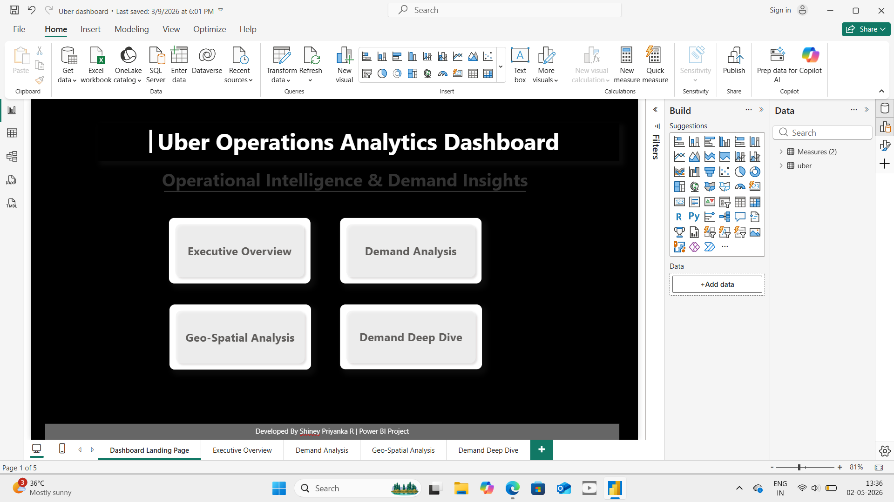
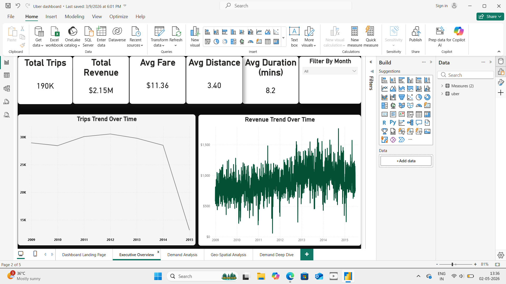
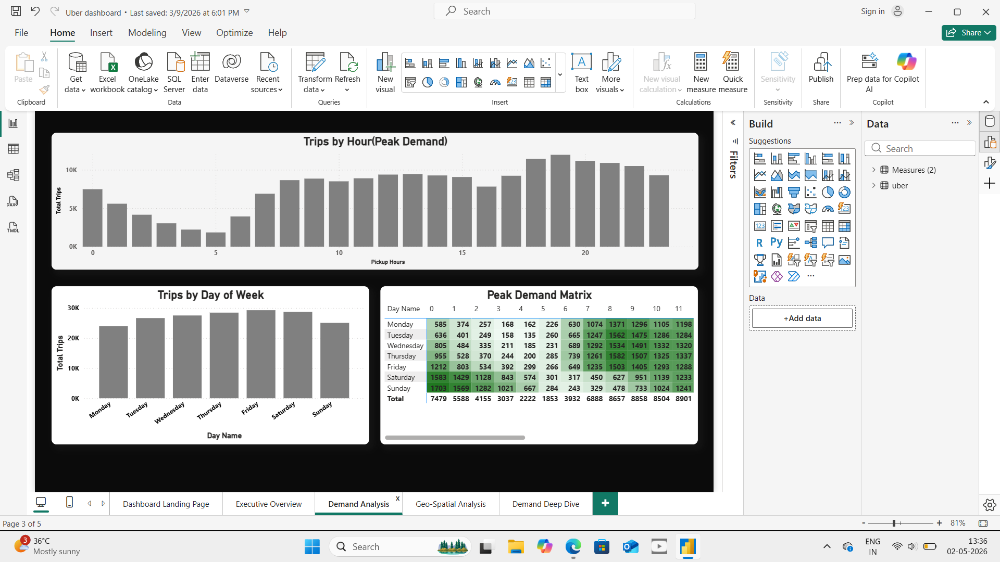
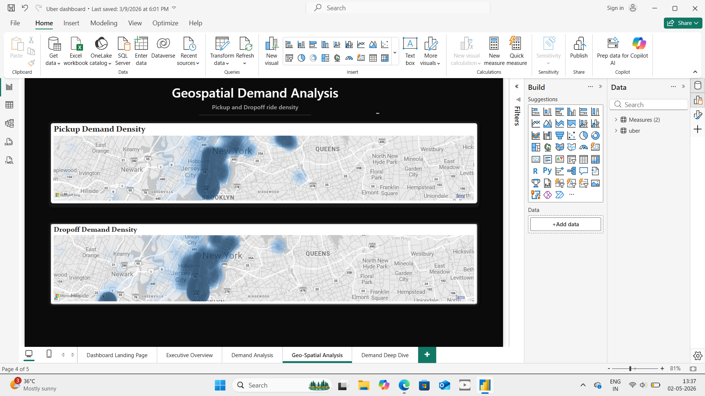

#  Uber Operations Analytics Dashboard (Power BI)

##  Project Overview
This project analyzes Uber trip data to uncover insights on ride demand, revenue trends, and geospatial patterns.

##  Key Insights
- Peak demand occurs during evening hours
- High ride density in central urban areas
- Revenue trends follow demand patterns
- Trip behavior varies by time and distance

##  Dashboard Features
- Executive overview with KPIs
- Demand analysis by hour and day
- Geospatial pickup & dropoff heatmaps
- Drill-through deep dive analysis
- Interactive filters

##  Tools Used
Power BI | DAX | Data Visualization | Data Modeling

##  Dashboard Preview

### Landing Page

### Executive Overview

### Demand Analysis

### Geospatial Analysis

### Deep Dive

##  License
This project is licensed under the MIT License.
